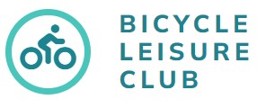
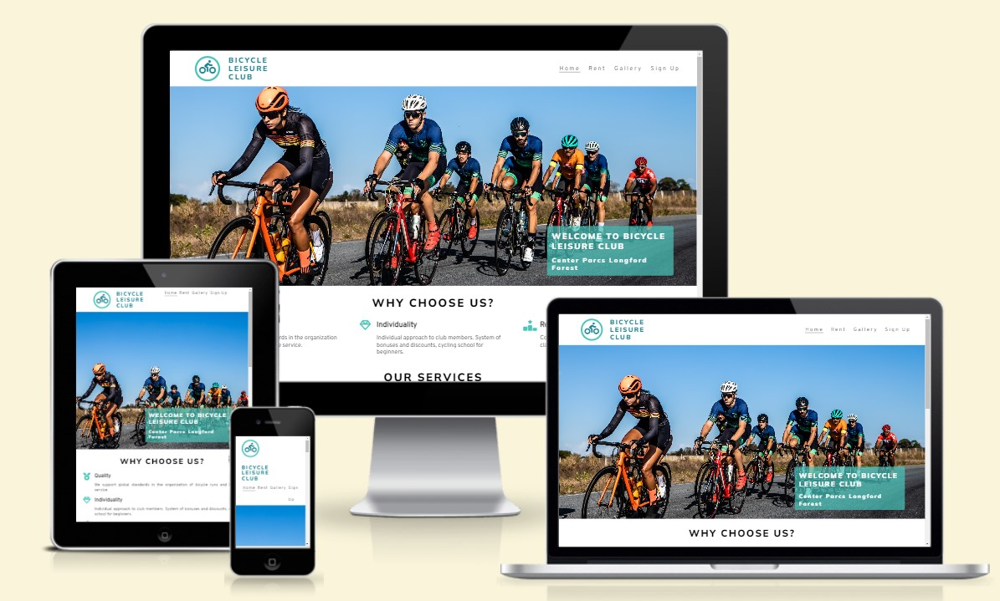
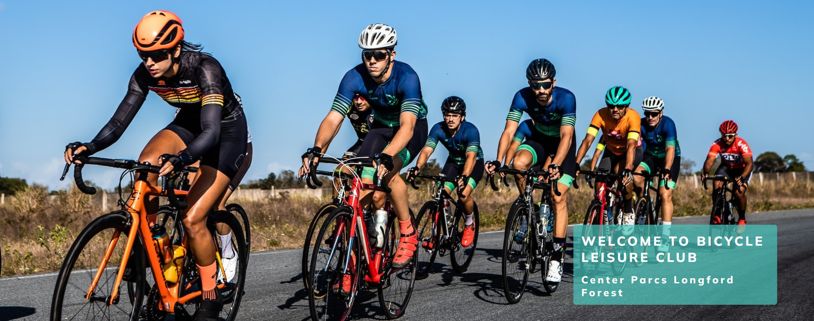
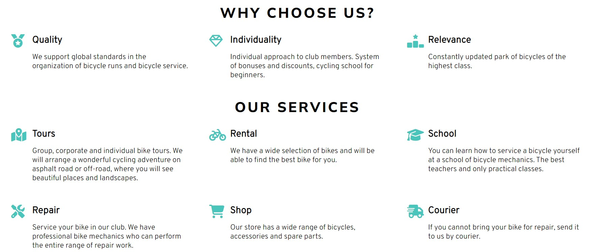
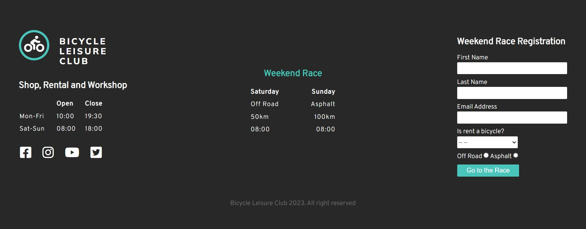
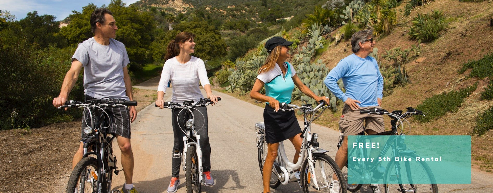
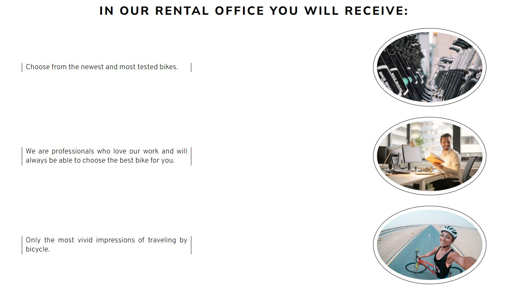
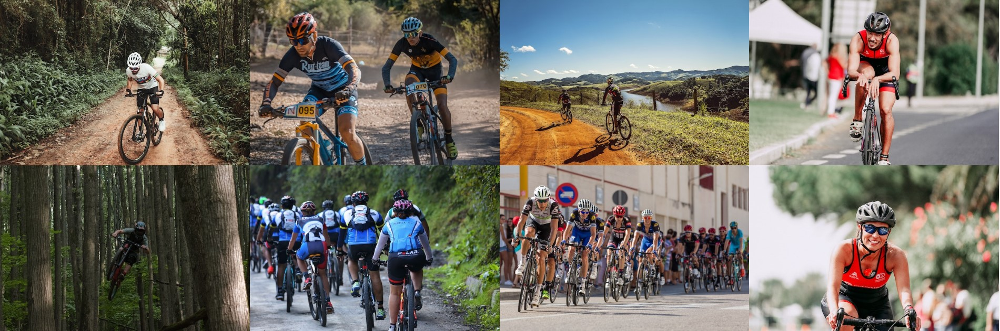
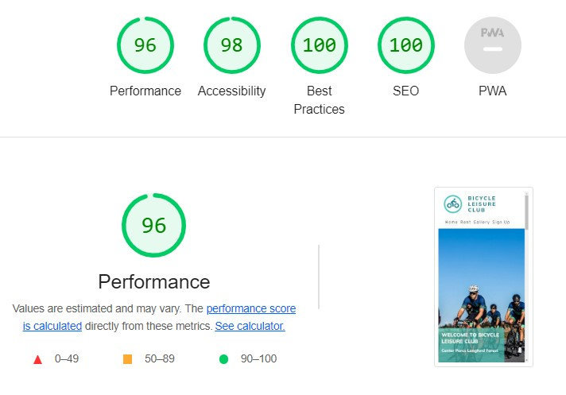

[](https://satogako.github.io/bicycle-leisure-club/)

---

The Bicycle Leisure Club is a  landing website page for men and women looking for active recreation. The Bicycle Leisure Club offers scenic off-road bike races, asphalt road races and organizes customized bike tours. The club offers: bicycle rental, bicycle repair school, workshop, bicycle and accessories shop, courier delivery. 

Users of this website will be able to find all the information they need about Bicycle Leisure Club: about the club, race schedule, hours of operation of additional services and registration form. This site is aimed at people over 18 years old who are looking for active recreation.




## Home page
---

* Navigation
    - Featured at the top of the page, the navigation shows the club name in the left corner: Bicycle Leisure Club also works as a link to the home page.

    - Other navigation links are located on the right: Home, Rent, Gallery, which link to individual pages of the site, and the Sign up link directs the user to the registration form.

    - The club header font and logo contrast in color with the background and other text.

    - The navigation clearly tells the user the name of the club and website and makes the different sections of
    information easy to find.

    
    


* Backgroung image and cover text section
    - The image shows the club's cyclists during the competition.

    - The background is placed on the image to clearly separate the text and the photo with the greeting and the address of the club.

    - This section provides the user with clear, intuitive information about what the club does and where it is located.

    
    


* Why choose us and our services section
    - The Why Chose Us section provides information about what makes it a special club and why people choose it.

    - Our Services section shows the user important information that the club offers to its members.

    - All paragraphs are separated by icons that contrast with the text of the paragraph for the user's intuitive understanding of what is written in it.

    
    


* Footer section
    - This section allows the user to register, understand the opening hours of the club and when the bike race will take place.

    - The chapter is divided into three parts. Individual elements contrast in color with the text to better separate these parts. These elements are located along an imaginary line that directs the user's eye to the registration form.

    - Social network icons and the registration button change color when hovering over them.

    - The Footer section is the same on all three pages of the site.

    
    


## Rent page
---


* Backgroung image and cover text section
    - The background of the image gives a clear impression to the user that people are happy with the bike rental.

    - The image features a contrasting background with text informing the user of a free bike ride to encourage the user to use this service.

    
    


* Rental Office
    - This section is designed as a list with photos

    - The text describes the image as briefly as possible so that the user can quickly understand the content of the section and use the service without hesitation.

    
    


## Gallery page
---

* Photos section
    - This section shows twenty photos of club members

    - This section gives a clear understanding that the club has been around for a long time and further encourages the user to sign up for membership.

    


## Testing
---
* I tested that this page works in different browsers: Chrome, Firefox, Opera.

* I confirmed that this project is responsive, looks good and functions on all standard screen sizes using the
    devtools device toolbar.

* I confirmed that the navigation, header, about club, about rent bicycles, sign up, and opening time are all readable and easy to
    understand.

* I have confirmed that the form works: requires entries in every field, will only accept an email in the email field,
    and the submit button works.


### Mistakes


* Fixed bugs

    - Before deploying the project to Git Hub, I found that the Sign up link only worked on one page.

    - Checked that I was using the same #signup-form identifier in all the HTML files for the link.
        ```
        <li>
        <a href="#signup-form">Sign Up</a>
        </li>
        ```
     - I solved the problem by providing Sign up on each page with a separate identifier from the footer section.


### Validator Testing

* HTML
    - No errors were returned when passing through the official W3C validator

* CSS
    - No errors were found when passing through the official Jigsaw validator

* Accessibility
    - I confirmed that the colors and fonts chosen are easy to read and accessible by running it through lighthouse

     
     


### Unfixed Bugs

No unfixed bugs


## Deployment
---

 * The site was deployed to GitHub pages. The steps to deploy are as follows:

    - In the GitHub repository, navigate to the Settings tab

    - From the left, in the Code and automation section, select Page

    - From the source section drop-down menu, select the Master Branch

    - Once the master branch has been selected, the page provided the link to the completed website.

The live link can be found here - [Bicycle Leisure Club](https://satogako.github.io/bicycle-leisure-club/)


## Credits
---

#### Content

* The code to make the gallery photos section  was taken from the Cl [Love Running Project](https://satogako.github.io/love-running/).

#### Media

* The images was taken from [Pexels](https://www.pexels.com/).


